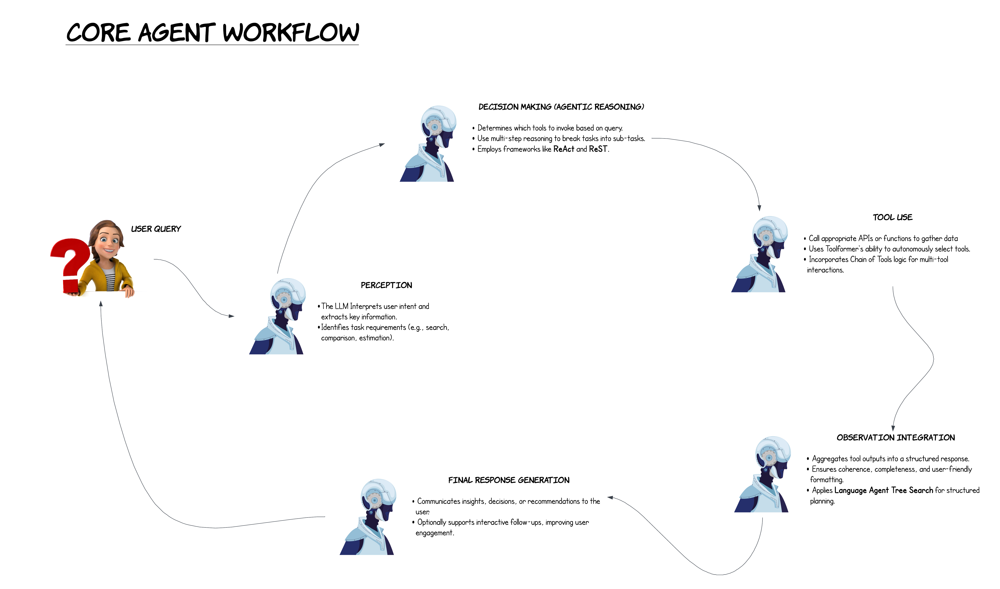

# A Conceptual Map of the Agentic Workflow

# Core Agent Workflow
After a user has sent a query to an LLM agent, it typically performs the following:

1. ### Perception (User Query Understanding)
    The LLM parsers the user's query, interprets the intent and extracts key information. It also identifies the tasks requirements such as whether the user wants the agent to search something, maybe compare two items or estimate a figure.

2. ### Decision Making (Agentic Reasoning)
    After the query is perceived, the agent starts reasoning and taking appropriate actions. For instance it may decide which tool to invoke based on the query, use multi-step reasoning to break tasks into sub-tasks.
    An effective way of performing these steps is by using frameworks like **ReAct** and **ReST**.

3. ### Tool Execution (Interfacing with External Tools)
    In order to obtain live information, the agent might need to consult external sources such as databases or sensors, therefore it calls appropriate APIs or functions to gather data. Toolformer is an AI model trained to autonomously select tools. The agent may also incorporate **Chain of Tools** logic for multi-tool interactions.

4. ### Observations Integration (Synthesizing Results)
    Once a response is obtained from the APIs, the agent aggregates tool outputs into a structured response while ensuring coherence, completeness and user-friendly formatting. The agent also applies **Language Agent Tree Search** for structured planning.

5. ### Final Response Generation
    The agent then communicates insights, decisions, or recommendations to the user. Optionally it also supports interactive follow-ups, improving user engagement.

 

# Overview of LLM Reasoning and Tool Use:

1. **Reasoning & Acting (ReAct):**
The core concept in this paper is called ReAct. It combines reasoning (thinking) with acting (doing) within LLM to solve problems. In a ReAct workflow, LLMs generate thought processes alongside actions, allowing for a feedback loop that refines both the reasoning and the action taken. It involves direct interaction where the model reasons about a problem, decides on an action, executes it, and then uses the outcome to further refine its reasoning.

2. **Toolformer:**
The core concept in this paper is that LLMs autonomously learn to use tools through interaction with APIs or external tools, enhancing their capability beyond static knowledge. The workflow involves a training phase where models learn from demonstrations or self-generated examples of tool use. Toolformer builds on ReAct by providing the model with the means to interact with external systems, thus expanding the "acting" component.

3. **ReST meets ReAct:**
ReST stands for "Reinforce Self-Training". The core idea is the intergration of self-evaluation and improvement into the ReAct framework for multi-step reasoning.This framework employs a self-reflective loop where the model assesses its own reasoning and actions, adjusting strategies for better outcomes. By incorporating ReST into ReAct; by adding layers of self-improvement, the synergy between reasoning and action is enhanced.

4. **Chain of Tools:**
The Chain of Tools papers proposes that LLMs can automatically discover and sequence the use of multiple tools to solve complex tasks. Models learn to chain tools in a sequence that logically progresses towards a solution. Chain of Tools approach amplifies the tool-using capabilities of Toolformer by focusing on the orchestration of multiple tools.

5. **Language Agent Tree Search (LATS):**
Language Agent Tree Search (LATS) is an impressive paper that unifies reasoning, acting, and planning by employing a tree search algorithm (specifically Monte Carlo Tree Search) over possible action sequences. The agent explores different action paths, backtracking when necessary, to find the optimal solution. LATS provides a structured approach to problem-solving where each node in the tree represents a different state of reasoning or action.

### All in all...
Each paper buils on ideas from previous research while also incorporating some novel elements. These papers have a common theme of prompting and post training manipulations that involve concepts like reasoning, acting, tool use, self-improvement and planning.